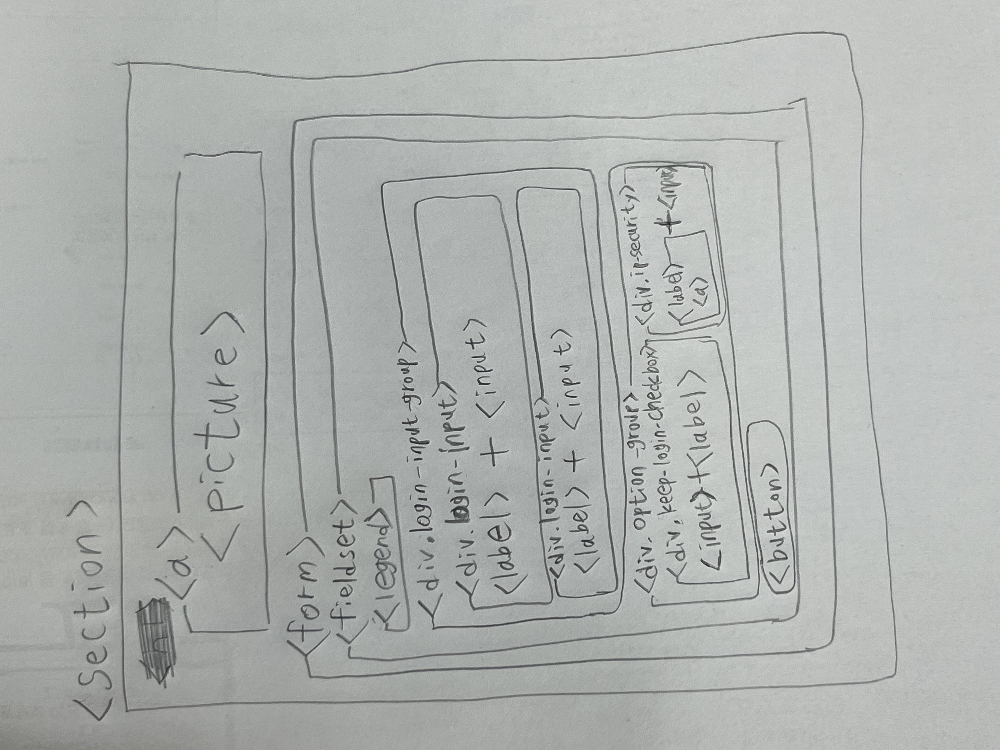

# Naver 로그인 폼

과제는 다음과 같은 조건을 만족할 수 있도록 구현한다.

**`마크업`**

- 로고 이미지는 배경이 아닌  요소로 마크업
  (svg를 지원하는 웹브라우저는 svg 형식으로 그렇지 않은 웹브라우저는 png 형식으로 보여지도록 구현)
- 웹접근성을 고려한 로그인 폼 서식 마크업
  (레이블 제공의 경우 WAI-ARIA가 아닌 HTML 네이티브 방식으로 구현)
- 아이디와 비밀번호는 필수 입력 서식임을 알 수 있도록 구현
- IP 보안 텍스트 클릭 시 미리 제공 된 ip_secruity.html 파일이 새창에 보이도록 구현
- 로그인 상태유지와 IP 보안 ON/OFF는 스위치는 키보드로도 조작 가능하도록 구현

**`스타일링`**

- 반응형으로 구현 (768px 미만 모바일 / 768px 이상 데스크탑)
- 모바일 퍼스트 (공통 스타일과 모바일 스타일을 먼저 구현한 후 데스크탑 스타일을 재정의 할 것)
- 글자 크기 및 여백(margin 및 padding)은 모두 rem 단위로 설정할 것)
- 기본 글자 크기 및 색상
  16px, #181818
- 로고
  가로 230px, 가운데 배치
- 포커스 스타일 커스텀 (색상 #24388d)
- 모바일 로그인 폼 로그인 폼의 가로 크기는 100%(좌/우 여백 각 20px 포함)
- 모바일 환경에서 IP 보안 ON/OFF 스위치는 사용자에게 제공되지 않도록 구현
- 데스크탑 로그인 폼의 가로 크기는 500px(좌/우 여백 각 20px 포함)
- 입력 서식 글자크기 및 세로 크기, 테두리 선 색상, 배경 색상
  기본 상태 : 14px, 45px, #dadada, #fff
  포커스 상태 : #03cf5d, #e9f0fd
- 로그인 버튼 글자 크기, 세로 크기, 글자 색상, 배경색상, 위쪽 여백
  16px, 45px, #fff, #03cf5d, 20px
- 로그인 상태유지 및 IP 보안 ON/OFF 영역 위쪽 여백 10px
- 로그인 상태유지 체크박스 배경 이미지 및 크기와 여백
  선택안함 : unchecked.svg
  선택함 : checked.svg
  가로 _ 세로 : 24px _ 24px
  배경 이미지 오른쪽 여백 : 5px
- IP 보안 스위치의 글자 크기 16px, 글자 색상 #181818

 

**`구현결과`**

**반응형 레이아웃**

**폼 서식을 마우스로 접근할 때**

**폼 서식을 키보드로 접근할 때**

**IP 보안 링크를 클릭할 때**

 

## HTML 마크업

### 손으로 그려본 마크업 구조

(처음 그렸던 마크업 구조와 많이 달라져서 다시 그림...)

### 구조 설계 및 접근성 고려

- 맨 위의 로고를 봤을 때, **클릭하면 홈으로 이동**한다는 생각이 들어서 <a\>요소로 마크업함.

- **email과 password** input을 하나의 그룹으로 묶어서 **컴포넌트**로 만듬. (+ required 속성으로 입력 필수)

- **focus 순서**가 로그인 button보다 option-group에 먼저 가기 때문에 마크업을 먼저함. (접근성도 up)

- 관련된 각각의 input(email, password, checkbox)과 label을 div(group)으로 묶어줌. **(role="group" 속성)**

- ip보안 switch는 checkbox로 구현하되, appearance:none 속성으로 화면에서 숨기고 **(스크린 리더에서는 읽음)**, **input::after 가상요소를 사용하여 ON/OFF 텍스트**를 보여줄 수 있다고 생각해서 <input type="checkbox" /\>로 구현함.

- "ip보안" 텍스트를 <label\> 안에 <a\> 요소로 감싸서 넣어봤는데, Chrome extension의 스크린 리더로 확인했더니, **"ip보안 링크", "ip보안 체크박스"라고 정상적으로 읽어주었다.**

 

## CSS

### 컴포넌트화

- email과 password 두 개의 input을 묶어서 컴포넌트화. (gap 변수 지정.)

  - 각각의 input 또한 그 안에서 border-color, height 등을 변수로 지정해 언제든 분리할 수 있다.

- "**로그인 정보 저장**"과 "**ip보안**"은 둘 다 checkbox로 구현했고, 원래 있던 checkbox를 보이지 않게 하는 등, **비슷한 스타일**을 가지기 때문에 컴포넌트로 구현 후 **필요한 부분만 재정의**.

- 다른 페이지를 더 만들어야 했다면, button 요소도 컴포넌트로 분리하면 좋았을 것 같다.

### 미디어

- **모바일 퍼스트** 구현 후, **@media 규칙**을 사용해서 모바일과 데스크탑에 **필요한 부분만 재정의**.

- 모바일 환경에서는 **ip보안 그룹이 보이지 않게 display: none;** 속성을 사용.

- **모바일 환경**에서는 '로그인 button' 아래에 '로그인 정보 저장' 하나만 오른쪽 끝에 위치하기 때문에 **justify-content: flex-end;** 속성을 사용.
   **데스크탑 환경**에서는 두 개의 그룹을 양쪽 끝에 배치하기 위해 **justify-content: space-between;** 속성을 사용.

 

## etc

순수 HTML과 CSS만으로 이렇게 많은 것을 할 수 있다는 것이 놀라웠다.
마크업과 레이아웃은 너무 쉽고, javascript부터가 진짜라고 생각했는데...

얕게 공부했던 React에서나 봤던 컴포넌트화를 HTML,CSS로 해보면서, 더 깊이 이해할 수 있었고, HTML 마크업 구조를 만들 때부터 컴포넌트와 접근성까지 염두에 두고 만들어보니, "그동안 무시했던 HTML이 이렇게나 재밌고 충분한 기능을 가지고 있었구나", "나는 절반도 모르고 사용하고 있었구나" 등 많은 것을 느끼고 성장할 수 있었던 것 같다.

이렇게 여러가지를 신경쓰면서 만들어본 적은 처음이라 많은 시간을 쏟았는데, 현업에서는 시간을 얼마나 투자하는지 문득 궁금하면서, 이대로 열심히 하다보면, 좋은 그리고 차별성있는 개발자로 성장할 수 있겠다는 생각이 들었다. 앞으로도 화이팅!!
